# Medical Record System v1.0

This is a medical record system using a React frontend for the UI that a patient, employee, or admin can log into and save a medical record to a database.
The backend uses javascript and AXIOS to connect to the database.
With this application I used a SQL database. (I used MAMP to create and manage my database)
  - The database had 2 tables, a login table that keeps track of all the login information and passwords (which is saved as a hash).
  - and a reocrds table that keeps track of the patients information and medical information.

## Installation:
  1. Create the SQL database. (in the main Github directory there is a MEDRECSYS sql script file that can be used.)
  2. Configure the backend (.env file) to connect to the database. 
  3. Create the first account as a admin account. * (All accounts are created as patient accounts by default. Can skip if you used the SQL script)
  4. Need to log into database and change the ROLE of the first account to A for admin. * (can skip if you used the SQL script)
  5. Login as Admin and created employees accounts.

# Using the Medical Record System:

## Creating a Login Account:
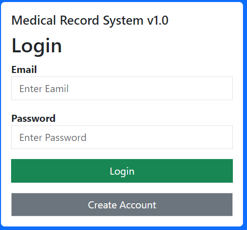.
 - At home page click on the the "Create Account" button.
 -  Fill out all required fields.
 -   Click the "Create Account" button.
    
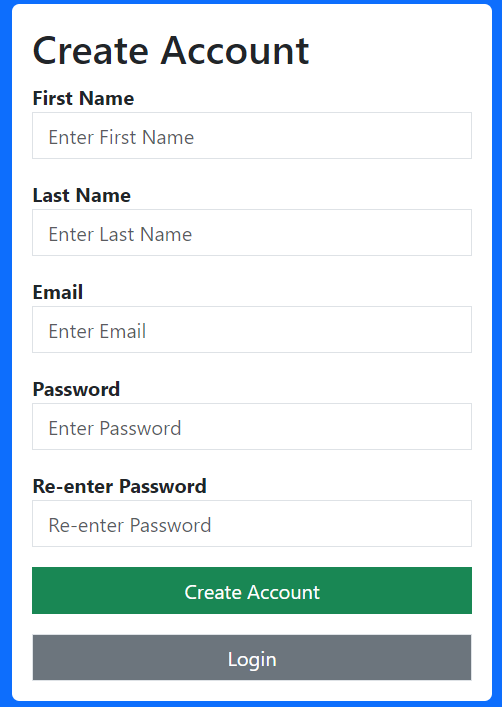

- Fill out the all the fields and then click "Create Account" button to create your login account.
## Logging into Website:
.
  - At home page input Email address and Password. * (If you don't have an account please create one)
  - Click the "Login" button.

## As a Patient you have access to the following actions.
 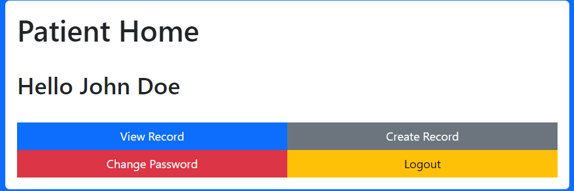
1. View Record. (If you have a record created already)
2. Create a Record. (Only if you don't have a record already)
3. Change Password.
4. Logout.

   ### To View a Reocrd:
   - Click on the "View Record" button.
   
  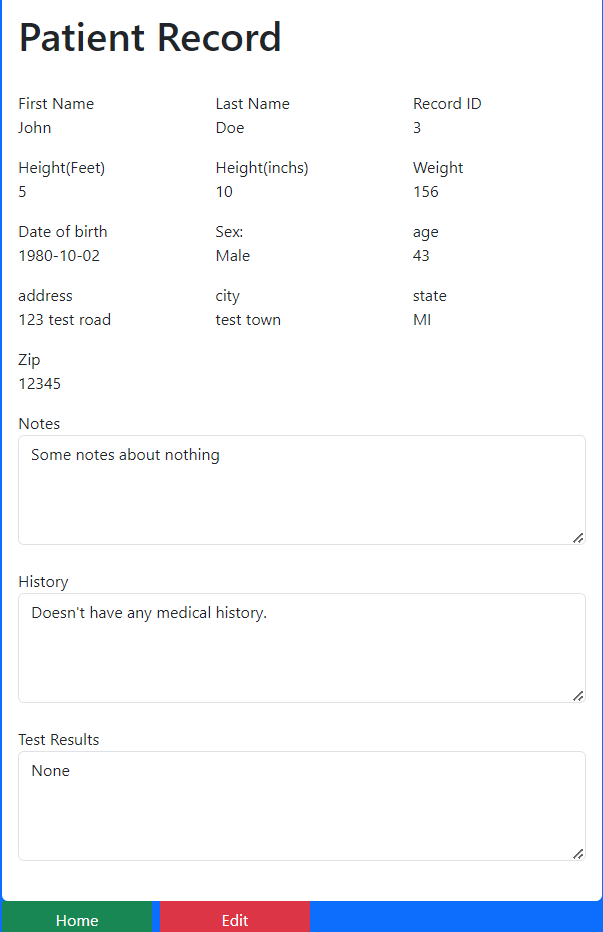
  
  On the View Record page you have two options.
  - Home (Takes you back to the patient home page).
  - Edit (Lets you edit your record).

  ### Edit Record.
  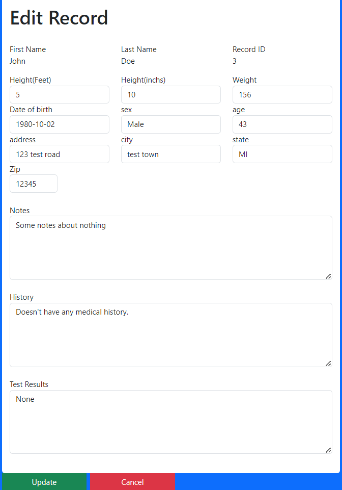.
  
  - You make update any field that allowes you to update. (can not update First name, last name, Record Id.)
  - Once fields has been updated click on the "Update" button.
  
  ### Creating a Record.
  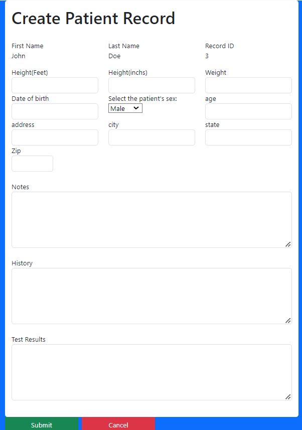
  
  - Fill out all fields and then click "Create" button to create your record.
  
  ### Change Password.
  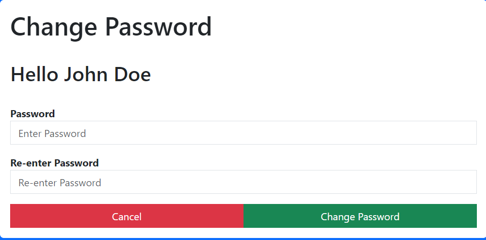.

  - Enter new password 2 times and then click "Change Password". (You will get a pop up message saying password was changed)
  - To Cancel click the "Cancel" button.
  
  ### Logging out.
  - Clicking the logout button will just take you back to the home page. 

## As a Staff Memeber you have acces to the following actions:
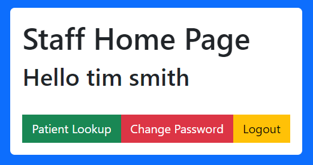.
1. Patient Lookup.
2. Change Password.
3. Logout.
   
   ### Patient Lookup:
   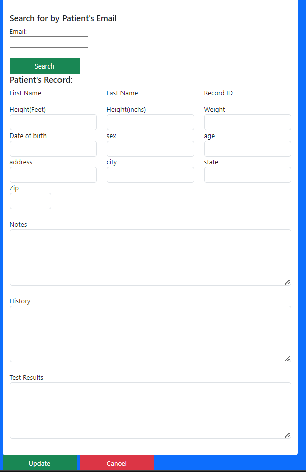.

   - Click on "Patient Lookup"
   - In the search field type in the patient's email address then click "Search"
   - Patient's information should auto fill in the fields and then you will be able to update any field.
   - If any field needed to be updated click "Update" once field(s) have been updated.

   ### Change Password:
   .

   - Enter new password 2 times and then click "Change Password". (You will get a pop up message saying password was changed)
   - To Cancel click the "Cancel" button.

   ### Logout:
     - Clicking the logout button will just take you back to the home page.

## As a Admin you have access t othe following actions:
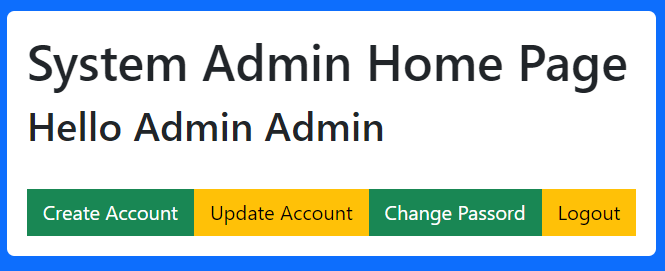
1. Create Account.
2. Update Account.
3. Change Password.
4. Logout.

   ### Create Account:
   

    - Click on the "Create Account" button.
    - Fill out all required fields.
    - Click the "Create Account" button.

   ### Update Account:
   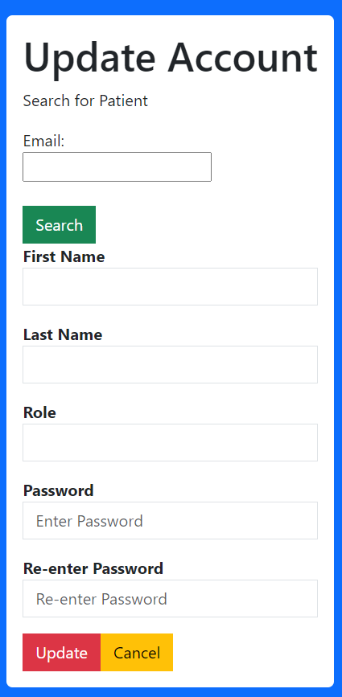

   - Click on "Update Account" Button.
   - Enter the login account email in the seach field you wanted to update and click "Search" button.
   - You can update any field inculding setting a new password.
   - Once field(s) have been updated click the "Update" button.

   ### Change Password:
     .

   - Enter new password 2 times and then click "Change Password". (You will get a pop up message saying password was changed)
   - To Cancel click the "Cancel" button.

   ### Logout:
     - Clicking the logout button will just take you back to the home page.

